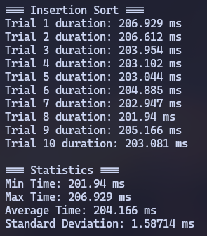
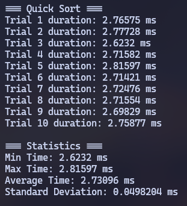
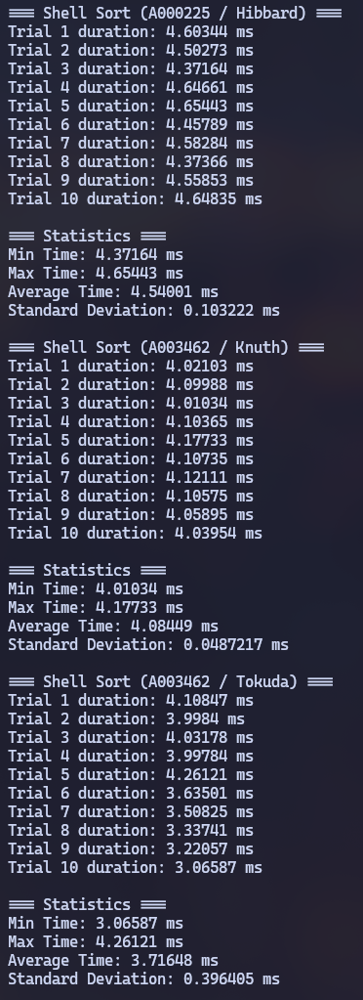
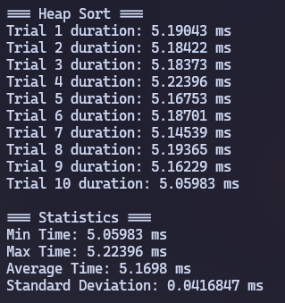

# Micro Assignment 4

> Sorting Algorithms

## Analysis

### I. Performance Comparisons

In order of best to worst performance (lowest to highest average time):

1. Quick Sort: ~2.7 ms
2. Shell Sort: ~3.5 ms (but more variance than heap sort)
3. Heap Sort: ~4.8 ms
4. Insertion Sort: ~204 ms

These are averages of 10 different trials (running `make exec` 10 times).

### II. Why Quick Sort?

Quick sort outperforms shell sort and insertion sort because quick sort has a time complexity of $O(N \log N)$, which is faster than $O(N^{1.5})$ and $O(N^2)$ for shell sort and insertion sort respectively.

Quick sort also outperforms heap sort due to quick sort's *locality of reference*, allowing for better cache utilisation.

However, it was interesting that shell sort outperformed heap sort, even with a slower time complexity. This is likely because shell sort, like insertion sort, performs better on smaller data sets.

### III. Shell Sort Sequences

In order of best to worst performance (lowest to highest average time):

1. `A108870` (Tokuda): $\left\lceil \frac{1}{5} * (9 * \frac{9}{4}^(k - 1) - 4) \right\rceil$
2. `A003462` (Knuth): $\dfrac{3^k - 1}{2}$
3. `A000225` (Hibbard): $2^k - 1$

I ended up choosing Tokuda's sequence because it almost always outperformed the others.

## Screenshots

